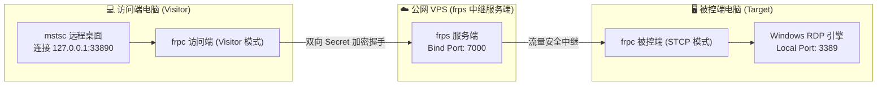

# 轻量级高性能内网穿透：frp 远程桌面 RDP 搭建与全平台配置实战

## 🌐 一、架构原理与穿透模式选型

在远程办公或跨网络运维场景中，Windows 原生远程桌面协议（RDP, 默认端口 `3389`）凭借极低的操作延迟、原生剪贴板互通以及无缝音频/磁盘重定向，体验远优于常规第三方远程控制软件。然而，绝大多数家庭宽带与公司内网均处于 NAT 局域网之后，缺乏公网 IP。

**frp (Fast Reverse Proxy)** 是一款采用 Go 语言开发的高性能反向代理应用，能够将内网服务通过拥有公网 IP 的 VPS 服务器安全暴露至公网。



---

### 📊 核心穿透模式技术对比矩阵

| 模式 | 传输协议 | 公网暴露端口 | 安全性 | 适用场景 |
| :--- | :--- | :--- | :--- | :--- |
| **STCP (安全 TCP)** | 端到端加密 TCP | 仅需服务端通信端口 | 🟢 **极高**（无公网暴露，双向密钥鉴权） | **强烈推荐**：个人与公司核心远程桌面 |
| **TCP 直接映射** | 标准 TCP 转发 | 需要额外暴露公网端口 | 🟡 **中等**（暴露端口易遭受暴力破解扫描） | 临时调试、无法在访问端安装 frpc 的场景 |
| **XTCP (P2P 穿透)** | UDP 打洞直连 | 仅握手时使用公网端口 | 🟢 **极高**（打洞成功后流量不消耗 VPS 带宽） | 大文件传输、双方 NAT 拓扑简单的网络环境 |

> [!TIP]
> 强烈推荐使用 **STCP (Secret TCP)** 模式！该模式下 VPS 无需对外开放远程桌面端口，任何扫描工具均无法探测到你的 3389 服务，必须在访问端同时运行带有相同密钥（`sk`）的 frpc visitor 才能建立隧道。

---

## 🚀 二、VPS 服务端部署步骤 (CentOS / Debian / Ubuntu)

### 方案 A：使用一键自动化部署脚本（最简推荐）

本站文件库提供了封装好的 `frps.sh` 交互式一键部署脚本，支持自动化配置端口、随机高强度 Token、Systemd 守护进程及状态巡检：

> 💾 **一键脚本下载**：可在本站资源中心下载或免跳转在线高亮预览 [frps.sh](../assets/files/frps.sh)。

```bash
# 1. 下载一键脚本并赋予执行权限
wget https://raw.githubusercontent.com/mvscode/frps-onekey/master/frps.sh -O frps.sh
# 或直接从本站下载:
# wget https://vmrey.github.io/assets/files/frps.sh -O frps.sh

chmod +x frps.sh

# 2. 运行安装向导
./frps.sh
```

---

### 方案 B：手动二进制部署与 Systemd 守护配置

#### 1. 下载并解压最新发行包
前往 [frp GitHub Releases](https://github.com/fatedier/frp/releases) 获取适用于 Linux 的最新二进制文件：

```bash
# 创建程序目录
mkdir -p /usr/local/frps && cd /usr/local/frps

# 下载对应架构压缩包 (以 amd64 为例)
wget https://github.com/fatedier/frp/releases/download/v0.58.1/frp_0.58.1_linux_amd64.tar.gz

# 解压并整理核心文件
tar -xzvf frp_0.58.1_linux_amd64.tar.gz
cp frp_0.58.1_linux_amd64/frps ./
cp frp_0.58.1_linux_amd64/frps.toml ./
```

#### 2. 编写服务端配置文件 (`frps.toml` / `frps.ini`)

- **现代 TOML 规范 (`frps.toml` - 推荐 v0.52+ 版本)**：
```toml
# frps.toml
bindPort = 7000

# 身份验证令牌（请务必替换为高强度随机字符串）
auth.method = "token"
auth.token = "YourSuperStrongSecretToken_2026"

# 仪表盘管理后台（可选）
webServer.addr = "0.0.0.0"
webServer.port = 7500
webServer.user = "admin"
webServer.password = "Admin_Dashboard_Password_888"

# 传输层配置
transport.tcpMux = true
transport.maxPoolCount = 5
```

- **经典 INI 规范 (`frps.ini` - 兼容旧版)**：
```ini
# frps.ini
[common]
bind_port = 7000
token = YourSuperStrongSecretToken_2026

dashboard_port = 7500
dashboard_user = admin
dashboard_pwd = Admin_Dashboard_Password_888
tcp_mux = true
```

#### 3. 配置 Systemd 系统守护进程

创建 Systemd 服务单元，实现进程异常退出自动拉起与开机自启：

```bash
cat <<EOF > /etc/systemd/system/frps.service
[Unit]
Description=Frp Server Service
After=network.target syslog.target
Wants=network.target

[Service]
Type=simple
ExecStart=/usr/local/frps/frps -c /usr/local/frps/frps.toml
Restart=always
RestartSec=5s
LimitNOFILE=1048576

[Install]
WantedBy=multi-user.target
EOF
```

#### 4. 启动服务与防火墙放行

```bash
# 重载守护进程并设置开机自启
systemctl daemon-reload
systemctl enable --now frps

# 查看运行状态
systemctl status frps

# 防火墙端口放行 (以 UFW / Firewalld 为例)
# UFW (Debian / Ubuntu):
ufw allow 7000/tcp
ufw allow 7500/tcp
ufw reload

# Firewalld (CentOS / RHEL):
firewall-cmd --permanent --zone=public --add-port=7000/tcp
firewall-cmd --permanent --zone=public --add-port=7500/tcp
firewall-cmd --reload
```

> [!IMPORTANT]
> 如果 VPS 托管在阿里云、腾讯云、华为云或 AWS，必须同时在**云控制台的安全组规则 (Security Group)** 中放行 TCP `7000` 与 `7500` 端口，否则外部无法建立连接！

---

## 🖥️ 三、被控端 Windows 客户端配置 (Target)

### 1. 开启 Windows 远程桌面功能
1. 进入 Windows「设置」➔「系统」➔「远程桌面」；
2. 打开**「启用远程桌面」**开关；
3. 点击「高级设置」，确认启用「网络级别身份验证 (NLA)」。

---

### 2. 配置被控端 `frpc`

下载 Windows 版本的 frp 压缩包，解压至 `C:\frp\` 目录，编写配置文件：

- **现代 TOML 规范 (`frpc.toml`)**：
```toml
# C:\frp\frpc.toml
serverAddr = "1.2.3.4" # 替换为你的 VPS 公网 IP
serverPort = 7000

auth.method = "token"
auth.token = "YourSuperStrongSecretToken_2026"

# STCP 安全加密代理
[[proxies]]
name = "rdp_company_pc"
type = "stcp"
secretKey = "YourCustomSecretKeyForRDP_999"
localIP = "127.0.0.1"
localPort = 3389
transport.useEncryption = true
transport.useCompression = true
```

- **经典 INI 规范 (`frpc.ini`)**：
```ini
# C:\frp\frpc.ini
[common]
server_addr = 1.2.3.4
server_port = 7000
token = YourSuperStrongSecretToken_2026

[rdp_company_pc]
type = stcp
sk = YourCustomSecretKeyForRDP_999
local_ip = 127.0.0.1
local_port = 3389
use_encryption = true
use_compression = true
```

---

### 3. 使用 NSSM 将 frpc 注册为 Windows 系统服务（开机静默自启）

避免命令行黑窗口被误关闭，推荐使用 [NSSM (Non-Sucking Service Manager)](https://nssm.cc/) 注册为后台常驻系统服务：

```cmd
:: 1. 以管理员身份打开 CMD 或 PowerShell
:: 2. 进入 nssm 所在目录，安装服务
nssm.exe install frpc "C:\frp\frpc.exe" "-c C:\frp\frpc.toml"

:: 3. 启动并配置开机自启
nssm.exe start frpc
nssm.exe set frpc AppStdout "C:\frp\frpc_out.log"
nssm.exe set frpc AppStderr "C:\frp\frpc_err.log"
```

---

## 💻 四、访问端 Windows 配置与极速连接 (Visitor)

在随身携带的笔记本或外出使用的电脑上，同样解压 `frp` 并配置 visitor 访问者模式：

### 1. 编写访问端配置文件

- **现代 TOML 规范 (`frpc.toml`)**：
```toml
# 访问端 frpc.toml
serverAddr = "1.2.3.4" # 替换为你的 VPS 公网 IP
serverPort = 7000

auth.method = "token"
auth.token = "YourSuperStrongSecretToken_2026"

# STCP Visitor 访问者模式
[[visitors]]
name = "rdp_visitor"
type = "stcp"
serverName = "rdp_company_pc" # 必须与被控端的代理名称一致
secretKey = "YourCustomSecretKeyForRDP_999" # 必须与被控端 secretKey 一致
bindAddr = "127.0.0.1"
bindPort = 33890 # 本地监听端口
transport.useEncryption = true
transport.useCompression = true
```

- **经典 INI 规范 (`frpc.ini`)**：
```ini
# 访问端 frpc.ini
[common]
server_addr = 1.2.3.4
server_port = 7000
token = YourSuperStrongSecretToken_2026

[rdp_visitor]
type = stcp
role = visitor
server_name = rdp_company_pc
sk = YourCustomSecretKeyForRDP_999
bind_addr = 127.0.0.1
bind_port = 33890
use_encryption = true
use_compression = true
```

---

### 2. 制作一键快速连接批处理脚本 (`Start-RDP.bat`)

在桌面新建一个 `Start-RDP.bat`，双击即可一键在后台静默启动 visitor 并自动唤起 Windows 远程桌面：

```bat
@echo off
title RDP 快速直连通道
cd /d %~dp0

echo 正在建立与远程桌面的安全加密穿透隧道...
start /b frpc.exe -c frpc.toml

:: 等待隧道握手建立
timeout /t 2 /nobreak >nul

echo 正在启动 Windows 远程桌面...
start mstsc.exe /v:127.0.0.1:33890
exit
```

---

## ⚡ 五、Windows RDP 画面与网络性能极致调优

为了获得接近本地主机的 60FPS 丝滑远程操作体验，建议在**被控端 Windows** 进行以下系统级优化：

### 1. 开启 RemoteFX 与硬件图形加速 (组策略)
1. 按下 `Win + R` 输入 `gpedit.msc` 打开本地组策略编辑器；
2. 依次展开：`计算机配置` ➔ `管理模板` ➔ `Windows 组件` ➔ `远程桌面服务` ➔ `远程桌面会话主机` ➔ `远程会话环境`；
3. 将以下项设置为**「已启用」**：
   - **将硬件图形适配器应用于所有远程桌面服务会话**
   - **为远程桌面连接配置 H.264/AVC 硬件编码**
   - **优先使用 UDP 网络协议**

### 2. 注册表优化 TCP 连接吞吐
以管理员身份运行 CMD，执行以下优化指令：

```cmd
:: 开启 TCP 窗口缩放与复合拥塞控制
netsh int tcp set global autotuninglevel=normal
netsh int tcp set global congestionprovider=ctcp
```

---

## 🛠️ 六、高频踩坑与排障自检清单

> [!WARNING]
> 排查连接故障时，请遵循以下自检链条：

1. **`connect to server error` 报错**：
   - 检查 VPS 上 `frps` 进程是否正在运行 (`systemctl status frps`)；
   - 检查 VPS 云服务商控制台安全组是否放行了 TCP `7000` 端口；
   - 检查被控端与服务端配置中的 `token` 是否完全一致。

2. **`authorization failed for visitor` 报错**：
   - 检查访问端 `secretKey` (或 `sk`) 是否与被控端完全一致；
   - 检查访问端的 `serverName` 是否与被控端代理名 `name` 精确对齐。

3. **被控端休眠导致连接中断**：
   - 在被控端 Windows「电源和睡眠」设置中，将「睡眠状态」设置为**「从不」**；
   - 在设备管理器中找到网卡属性，取消勾选「允许计算机关闭此设备以节约电源」。
