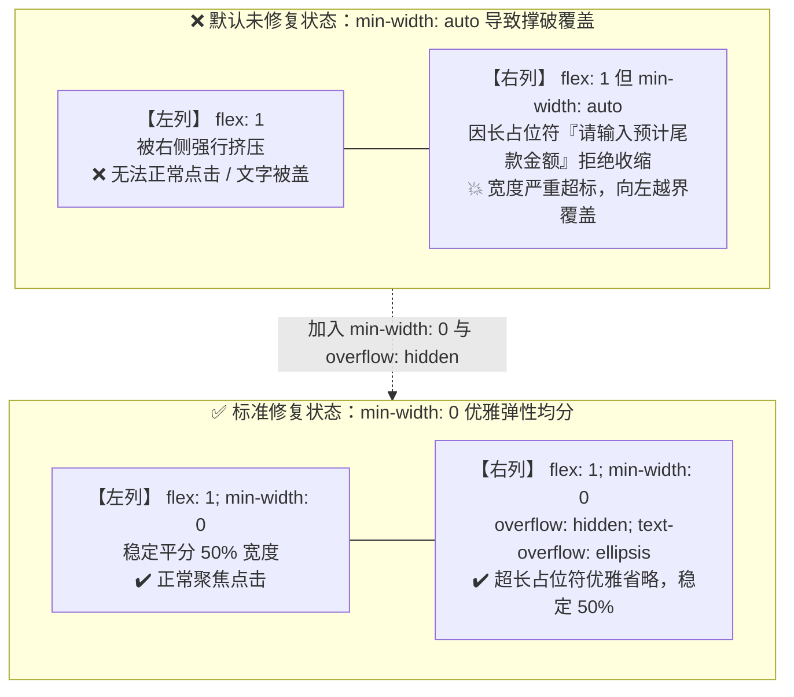

# 微信小程序与跨端开发排坑：彻底搞定键盘遮挡与输入框文字溢出（全平台兼容指南）

在移动端与跨端开发（微信小程序、uni-app、移动端 H5、混合 Webview）中，表单页面的 UI 布局与输入交互向来是线上 Bug 的高发区。开发者经常会遇到两类极其顽固且在多端表现各异的体验问题：
1. **软键盘弹起时输入框“半遮面”**：键盘升起后，页面虽有推顶，但输入框只露出一半，下半部及下边框被键盘死死遮挡；
2. **多列表单横向挤压变形**：在双列或多列等分栅格中，右侧输入框的长 placeholder 占位符越界撑爆父容器，导致相邻的左侧输入框被挤压甚至无法点击。

本文针对 **微信小程序（Android / iOS / 鸿蒙 HarmonyOS NEXT）**、**移动端 H5（iOS Safari / Android Chrome / 鸿蒙 ArkWeb）** 以及 **uni-app 跨端 App** 进行底层原理解析，并提供完整的全平台兼容适配代码与实战自检清单。

---

## 📊 一、全平台兼容性与底层机制矩阵

不同操作系统与运行时环境处理软键盘与表单渲染的底层机制差异极大，了解这些机制是写出高健壮性代码的前提：

| 平台 / 操作系统 | 键盘弹起核心机制 | `cursor-spacing` 属性支持度 | `adjust-position` 属性支持度 | Flex `min-width: 0` CSS 规范支持度 | 核心失效 / 踩坑场景 |
| :--- | :--- | :--- | :--- | :--- | :--- |
| **微信小程序 (iOS)** | 微信原生渲染层推顶 | 🟢 完美支持 (单位 px) | 🟢 完美支持 | 🟢 100% 完美支持 | 页面套用了固定高度 `height: 100%` 或 `overflow: hidden` 导致推顶被阻断 |
| **微信小程序 (Android)** | 微信原生渲染层推顶 | 🟢 完美支持 (单位 px) | 🟢 完美支持 | 🟢 100% 完美支持 | 默认 24px 间距过小，高尺寸输入框下半截被键盘遮挡 |
| **微信小程序 (HarmonyOS NEXT)** | 遵循微信官方跨平台基础库 | 🟢 完美支持 (单位 px) | 🟢 完美支持 | 🟢 100% 完美支持 | 行为与 iOS/Android 微信基础库一致 |
| **移动端 H5 (iOS Safari / Webview)** | WebKit 视口自动滚动 (Scroll) | ⚪ 无效（标准 HTML 无此属性） | ⚪ 无效（标准 HTML 无此属性） | 🟢 100% 完美支持 | 键盘收起后页面偶尔不回弹出现“大灰底”；绝对定位吸底按钮被顶乱 |
| **移动端 H5 (Android Chrome)** | Webview Resize / Pan | ⚪ 无效 | ⚪ 无效 | 🟢 100% 完美支持 | 键盘弹起导致 `window.innerHeight` 缩小，影响绝对定位容器 |
| **移动端 H5 (HarmonyOS 浏览器/ArkWeb)** | ArkWeb 视口联动调整 | ⚪ 无效 | ⚪ 无效 | 🟢 100% 完美支持 | 遵循现代 Chromium/W3C 规范 |
| **uni-app 跨端 App (iOS / Android / 鸿蒙)** | 原生窗口模式 (`softinputMode`) | 🟢 小程序/App 模式均支持 | 🟢 小程序/App 模式均支持 | 🟢 100% 完美支持 | 复杂嵌套滚动视图未留足底部安全距离 |

> [!NOTE]
> - **小程序专属属性**：`adjust-position` 和 `cursor-spacing` 属于微信/支付宝等小程序规范扩展，在原生 HTML/H5 中会被浏览器当成未知属性忽略。
> - **CSS3 标准规范**：Flex 容器子项的 `min-width: 0` 属于 W3C 现代标准规范，在所有现代移动浏览器、小程序、Webview 及各操作系统中均 **100% 表现一致**。

---

## 🕳️ 二、坑位一：键盘抬起遮挡输入框

### 1. 现象描述
用户点击页面下半部分的输入框时，软键盘弹起，页面产生上移，但**输入框仅露出上方文字，下半部边框甚至光标底端被键盘压住**。在长表单或高度较大的输入框（如高度 50px 以上或多行 `textarea`）中尤为明显。

### 2. 根因剖析
- **小程序底层逻辑**：`<input>` 与 `<textarea>` 属于原生组件层。微信默认提供的 `cursor-spacing="24"` 仅能保证光标点距离键盘 24px。如果输入框本身设计有较大的内边距（padding）或边框，光标露出来了，但输入框底部仍深陷键盘下方；
- **H5 端底层逻辑**：H5 没有小程序的 `cursor-spacing` 机制，浏览器仅依据默认对齐算法尝试把焦点元素推入可视视口。一旦外层套了 `position: absolute`、`overflow: hidden` 或使用了局部滚动容器，浏览器自动滚动就会彻底失效。

---

### 3. 针对不同场景的解决方案

#### 方案 A：微信小程序 / uni-app 小程序端专属参数调优（最简高效）
针对微信小程序（iOS / Android / 鸿蒙 NEXT），显式声明 `:adjust-position="true"`，并将 `cursor-spacing` 调大至 `80~100`：

```html
<!-- 单行输入框 (Vue 3 / uni-app 语法) -->
<input
  v-model="formData.name"
  class="custom-input"
  type="text"
  placeholder="请输入联系人姓名"
  placeholder-class="placeholder-gray"
  :adjust-position="true"
  :cursor-spacing="100" 
/>

<!-- 多行文本域 -->
<textarea
  v-model="formData.remark"
  class="custom-textarea"
  placeholder="请输入详细备注说明"
  placeholder-class="placeholder-gray"
  :adjust-position="true"
  :cursor-spacing="100"
/>
```

> [!TIP]
> - **长表单页面**：统一建议设置 `:cursor-spacing="100"`（单位 px），保证输入框与操作提示完全露出；
> - **弹窗/Modal 表单**：短表单建议保持 `24~40`，防止弹窗整体被推移出屏幕可见范围顶部。

---

#### 方案 B：移动端 H5 专用平滑居中滚动与收起回弹方案
在纯 H5 环境下（iOS Safari、Android Chrome、鸿蒙浏览器），通过 Vue 组合式 Hook 实现聚焦居中滚动与失焦回弹：

```typescript
// useH5InputScroll.ts - 移动端 H5 输入框聚焦与回弹解决方案
import { onMounted, onUnmounted } from 'vue';

export function useH5InputScroll() {
  /**
   * 输入框聚焦：平滑将元素滚动至屏幕中央
   */
  const handleFocus = (e: FocusEvent) => {
    const target = e.target as HTMLElement;
    if (!target) return;

    // 延时 300ms 等待 iOS / Android 键盘弹起动画完成
    setTimeout(() => {
      if (typeof target.scrollIntoView === 'function') {
        target.scrollIntoView({
          behavior: 'smooth',
          block: 'center', // 滚动到屏幕正中间，彻底避开键盘遮挡
          inline: 'nearest'
        });
      }
    }, 300);
  };

  /**
   * 输入框失焦：解决 iOS Safari 键盘收起后页面留白卡住不回弹的 Bug
   */
  const handleBlur = () => {
    // 仅在 iOS 环境下需要手动触发微小滚动回弹
    const isIOS = /iPad|iPhone|iPod/.test(navigator.userAgent);
    if (isIOS) {
      setTimeout(() => {
        const currentScrollY = window.scrollY || document.documentElement.scrollTop || 0;
        window.scrollTo({
          top: Math.max(currentScrollY - 1, 0),
          behavior: 'smooth'
        });
      }, 100);
    }
  };

  return { handleFocus, handleBlur };
}
```

在模板中直接使用：
```html
<template>
  <input 
    type="text" 
    class="h5-input" 
    placeholder="请输入手机号" 
    @focus="handleFocus" 
    @blur="handleBlur" 
  />
</template>

<script setup lang="ts">
import { useH5InputScroll } from './useH5InputScroll';
const { handleFocus, handleBlur } = useH5InputScroll();
</script>
```

---

#### 方案 C：跨端通用终极方案（动态底部安全 Padding 垫高）
对于使用 `<scroll-view>` 或局部滚动容器的复杂页面，通过监听键盘高度，在滚动容器底部**动态垫出等于键盘高度的空白区**：

```html
<template>
  <view class="page-wrapper">
    <!-- 主滚动容器：动态绑定 padding-bottom -->
    <scroll-view 
      scroll-y 
      class="form-scroll-view" 
      :style="{ paddingBottom: keyboardPadding + 'px' }"
    >
      <view class="form-container">
        <!-- 你的各类表单项 -->
        <view class="form-item" v-for="i in 10" :key="i">
          <text class="label">字段 {{ i }}：</text>
          <input class="input" placeholder="点击输入内容" />
        </view>
      </view>
    </scroll-view>

    <!-- 底部固定操作栏 -->
    <view class="bottom-bar" :style="{ transform: `translateY(-${keyboardHeight}px)` }">
      <button class="submit-btn">立即提交</button>
    </view>
  </view>
</template>

<script setup>
import { ref, computed, onMounted, onUnmounted } from 'vue';

const keyboardHeight = ref(0);

// 计算动态 Padding：键盘高度 + 底部安全区
const keyboardPadding = computed(() => {
  return keyboardHeight.value > 0 ? keyboardHeight.value + 20 : 0;
});

const onKeyboardHeightChange = (res) => {
  keyboardHeight.value = res.height || 0;
};

onMounted(() => {
  // #ifdef MP-WEIXIN || APP-PLUS
  if (typeof uni !== 'undefined' && uni.onKeyboardHeightChange) {
    uni.onKeyboardHeightChange(onKeyboardHeightChange);
  }
  // #endif

  // #ifdef H5
  // H5 端通过现代 VisualViewport API 精确监听
  if (window.visualViewport) {
    const handleResize = () => {
      const offset = window.innerHeight - window.visualViewport.height;
      keyboardHeight.value = offset > 100 ? offset : 0;
    };
    window.visualViewport.addEventListener('resize', handleResize);
  }
  // #endif
});

onUnmounted(() => {
  // #ifdef MP-WEIXIN || APP-PLUS
  if (typeof uni !== 'undefined' && uni.offKeyboardHeightChange) {
    uni.offKeyboardHeightChange(onKeyboardHeightChange);
  }
  // #endif
});
</script>

<style scoped>
.page-wrapper {
  position: relative;
  width: 100vw;
  height: 100vh;
  display: flex;
  flex-direction: column;
}

.form-scroll-view {
  flex: 1;
  box-sizing: border-box;
  transition: padding-bottom 0.25s ease-out;
}

.bottom-bar {
  position: fixed;
  left: 0;
  right: 0;
  bottom: 0;
  padding-bottom: env(safe-area-inset-bottom);
  background: #ffffff;
  transition: transform 0.25s ease-out;
  box-shadow: 0 -2rpx 10rpx rgba(0, 0, 0, 0.05);
}
</style>
```

---

## 🕳️ 三、坑位二：Flex 布局中 placeholder 溢出遮挡相邻元素

### 1. 现象描述
在窄屏设备上采用双列栅格等分布局（例如并排展示“预付定金”与“尾款金额”）：
- 当输入框右对齐且占位符较长（如 `placeholder="请输入预付款金额"`）时；
- 右侧输入框会**强行向左横向撑大**，突破自身划分的 50% 宽度，直接覆盖在左侧输入框上方；
- 导致左侧输入框被压住无法点击，界面错位。



### 2. 根因剖析
这是 CSS Flexbox 规范中极易被忽略的 **`min-width: auto` 机制**：
1. **W3C 规范**：Flex 容器内子项的 `min-width` 默认值不是 `0`，而是 `auto`；
2. **拒绝收缩**：子项的最小宽度由其内部的内容固有尺寸（content size）决定。如果子项里的 input placeholder 长度超过了 flex 分配的宽度，`min-width: auto` 会强制保持内容完整性，**拒绝响应 `flex: 1` 的收缩指令**；
3. **溢出覆盖**：输入框强行撑开，打破了栅格比例，越界遮挡左侧同级兄弟元素。

---

### 3. 全平台完美兼容解决方案

只需要两步核心 CSS 配置：
1. **解除子项限制**：为 flex 子项容器显式加上 `min-width: 0`；
2. **输入控件裁剪**：为 input 自身设置 `min-width: 0` 与 `overflow: hidden`。

```css
/* 双列行容器 */
.form-row-group {
  display: flex;
  align-items: center;
  gap: 16rpx;
  width: 100%;
}

/* 栅格列容器：核心是 min-width: 0 */
.form-row-group .form-col {
  flex: 1;
  min-width: 0; /* 核心：解除默认的 min-width: auto，允许列弹性收缩 */
  display: flex;
  align-items: center;
}

/* 输入框本身：必须同时配置 min-width: 0 与 overflow: hidden */
.input-control {
  flex: 1;
  min-width: 0;       /* 核心：允许 input 自身收缩到父容器分配宽度以内 */
  width: 100%;
  font-size: 28rpx;
  color: #333333;
  text-align: right;
  overflow: hidden;    /* 核心：截断超出宽度的长占位符文本 */
  text-overflow: ellipsis;
  white-space: nowrap;
}
```

```html
<view class="form-row-group">
  <!-- 左侧列 -->
  <view class="form-col">
    <text class="label">定金：</text>
    <input class="input-control" placeholder="请输入金额" />
  </view>
  
  <!-- 右侧列：长 placeholder 不会再撑破容器 -->
  <view class="form-col">
    <text class="label">尾款：</text>
    <input class="input-control" placeholder="请输入预计尾款金额" />
  </view>
</view>
```

> [!IMPORTANT]
> **兼容性结论**：该 CSS 方案基于 W3C Flexbox 现代标准规范，在 **微信小程序、H5、iOS Safari、Android Chrome、HarmonyOS ArkWeb、uni-app App** 均 100% 完美支持，且零平台副作用。

---

## 📋 四、移动端表单开发自检速查清单 (Checklist)

在上线微信小程序或移动跨端表单页面前，建议使用以下清单逐项自检：

### 1. 属性与参数自检
- [ ] 微信小程序中的 `<input>` 与 `<textarea>` 是否显式配置了 `:adjust-position="true"`？
- [ ] 表单中下部字段或高度较大的输入框是否设置了 `:cursor-spacing="100"`（单位 px）？
- [ ] 居中弹窗（Modal）中的输入框是否将 `cursor-spacing` 调小（24~40px）以防推顶越界？

### 2. CSS 布局与防挤压自检
- [ ] 所有包含 `input` / `textarea` / `text` 的 Flex 子项是否均显式声明了 `min-width: 0`？
- [ ] 多列输入框是否增加了 `overflow: hidden` 与 `text-overflow: ellipsis` 防长占位符撑爆？
- [ ] 页面外层是否避免了不当的 `position: fixed` 或非全屏 `overflow: hidden`？

### 3. 多端与 H5 专属自检
- [ ] 纯 H5 页面是否在 `@focus` 中绑定了 `scrollIntoView({ block: 'center' })`？
- [ ] 纯 H5 页面是否在 `@blur` 中加入了针对 iOS Safari 的滚动复位（防空白卡死）处理？
- [ ] 复杂局部滚动页是否采用了 `keyboardHeight` 动态垫高 `paddingBottom`？
- [ ] 底部固定按钮栏是否适配了底部安全区 `padding-bottom: env(safe-area-inset-bottom)`？

### 4. 真机测试覆盖自检
- [ ] **iOS 真机测试**：系统键盘与第三方输入法（搜狗/百度）弹起时是否平滑回弹、不挡框；
- [ ] **Android / 鸿蒙真机测试**：不同屏幕比例下多列长 placeholder 是否正确裁剪不遮挡邻居。

---

## 🎯 五、总结

移动端跨端表单体验的健壮性取决于对底层渲染机制的深刻理解：
1. **键盘遮挡**：微信小程序优先使用 `:adjust-position="true" :cursor-spacing="100"`；H5 环境使用 `scrollIntoView({ block: 'center' })`；复杂容器使用动态 Padding 垫高；
2. **横向挤压**：在任何 Flex 布局中，凡是使用了 `flex: 1` 且内部装有输入框或不可控长文本，**无条件为其加上 `min-width: 0` 与 `overflow: hidden`**。
