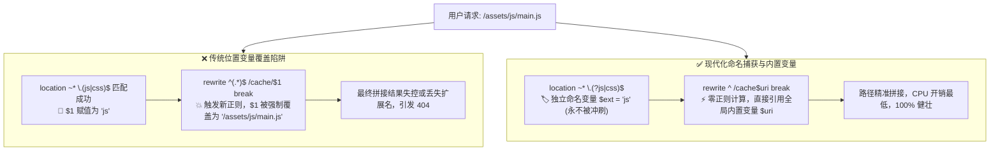

# Nginx 路径重写进阶：告别正则变量冲突，掌握命名捕获与内置变量极致写法

在 Nginx 配置中，为静态资源（如 `js`、`css`、`png`）配置长效浏览器缓存，并将它们在后台透明重定向到特定的缓存存储目录，是非常经典的反代与动静分离场景。

然而，很多开发者在编写正则表达式时，习惯使用系统默认的位置变量 `$1`、`$2`。这往往会埋下一个极其隐蔽的致命陷阱：**当外层 `location` 与内层 `rewrite` 同时使用了正则表达式时，内层的正则捕获会直接覆盖外层的 `$1`，导致重定向逻辑错乱或频繁出现 404**。

本文将通过静态资源缓存重写的经典案例，深入剖析变量覆盖的底层根因，并分享两种高级、安全且极度优雅的生产级 Nginx 配置方案。

---

## 🧭 一、核心问题：位置变量 $1 的覆盖与污染

在排查 Bug 之前，我们先理清位置捕获变量 `$1` 在 Nginx 执行上下文中的流转机制：



---

## 🎯 二、典型业务场景需求

假设我们有以下常见的生产配置需求：
1. **后缀拦截**：拦截所有以 `.js` 或 `.css` 结尾的静态文件请求；
2. **长效缓存**：设置 `expires 30d;`（30 天浏览器客户端强缓存）；
3. **静默重定向**：在后台透明重写到服务器本地的 `/wp-content/cache/staticfile/` 静态缓存目录，且不改变浏览器地址栏 URL。

---

## 💡 三、写法一：PCRE 正则命名捕获（安全自解释）

利用 PCRE（Perl Compatible Regular Expressions）的**命名捕获（Named Capture）**特性，我们可以直接给正则匹配到的分组成果“显式贴上命名标签”，彻底避免 `$1` 被后续逻辑无情冲刷：

```nginx
location ~* \.(?<ext>js|css)$ {
    # 开启客户端强缓存 30 天
    expires 30d;
    add_header Cache-Control "public, no-transform";

    # 将完整路径 (.*) 显式命名为 fullpath，生成独立变量 $fullpath
    rewrite ^(?<fullpath>.*)$ /wp-content/cache/staticfile$fullpath break;
}
```

### 逐行原理解析：
1. **`(?<ext>js|css)`**：相比传统的 `(js|css)`，加上 `?<ext>` 后，Nginx 会在内存中自动生成一个名为 **`$ext`** 的专属变量，其值为 `js` 或 `css`。它拥有独立的命名空间，绝对不会被后续的任何正则覆盖；
2. **`^(?<fullpath>.*)$`**：在 `rewrite` 指令中同样使用命名捕获，将用户请求的完整路径存入 **`$fullpath`** 变量；
3. **`break` 标志位**：完成内部路径重写后，立即终止当前阶段的 rewrite 规则，直接去磁盘寻找对应文件并返回，不再参与后续其他 location 的重新匹配。

> [!TIP]
> **适用场景**：代码“自解释”能力极强。团队接手维护时，无需反复数括号推测 `$1`、`$2` 代表什么，`$ext` 和 `$fullpath` 的业务意图一目了然。

---

## ⚡ 四、写法二：内置变量 $uri（极致优雅、性能最高）

虽然“命名捕获”非常清晰，但针对“获取当前请求的完整 URI 路径”这一需求，Nginx 原生提供了性能更高的全局内置变量：**`$uri`**。

既然 `$uri` 本身就代表了当前的完整规范化请求路径（如 `/assets/js/main.js`），我们完全可以省去 `rewrite` 中的正则匹配与字符串捕获开销：

```nginx
# ✅ 专家级推荐：极致优雅且性能最高的写法
location ~* \.(?<ext>js|css)$ {
    # 开启客户端强缓存 30 天
    expires 30d;
    add_header Cache-Control "public, no-transform";

    # rewrite 正则缩减为单个 ^，直接拼接全局变量 $uri
    rewrite ^ /wp-content/cache/staticfile$uri break;
}
```

### 逐行原理解析：
1. **`location` 块保留命名捕获**：保留 `(?<ext>...)` 是良好习惯，方便后续如果需要在响应头输出 `add_header X-Asset-Type $ext;` 时随取随用；
2. **`rewrite ^`**：这里的正则表达式被精简到了极致——只有一个 `^`（匹配任意请求的起点）。**完全没有捕获括号，省去了正则回溯与内存分配的 CPU 开销**；
3. **`$uri`**：直接读取 Nginx 内核在解析请求行时就已初始化的内置变量 `$uri`，实现纳秒级的高效无缝拼接。

---

## 📊 五、三种写法深度对比矩阵

| 对比维度 | 传统写法 (`$1` / `$2`) | 进阶写法一 (命名捕获 `(?<name>)`) | 进阶写法二 (内置变量 `$uri`) |
| :--- | :--- | :--- | :--- |
| **可读性与自解释** | 🔴 极差（容易数错分组） | 🟢 极佳（显式语义化变量名） | 🟢 极佳（极简直观） |
| **抗覆盖安全性** | 🔴 极易被嵌套 rewrite 污染 | 🟢 100% 隔离安全 | 🟢 100% 隔离安全 |
| **CPU 正则开销** | 🟡 两次正则捕获开销 | 🟡 两次正则命名捕获开销 | 🟢 **最低（仅一次后缀正则，重写 0 计算）** |
| **维护成本** | 🔴 易踩 404 隐蔽 Bug | 🟢 低 | 🟢 极低 |
| **综合推荐指数** | ❌ 强烈弃用 | ⭐⭐⭐⭐ | ⭐⭐⭐⭐⭐ **(首选)** |

---

## ❓ 六、常见疑问：需要安装第三方模块吗？

很多开发者在看到 `(?<name>...)` 这类语法时，常常会有疑虑：*“我的 Nginx 支持这种写法吗？需要额外编译 Lua 模块或第三方扩展吗？”*

**答案是：100% 原生支持，零额外依赖！**

1. **PCRE 命名捕获支持**：Nginx 底层正则引擎基于 PCRE。早在 **Nginx 0.8.25（2009 年发布）** 版本起，官方就已原生打通了命名捕获与 Nginx 变量系统的无缝绑定；
2. **`$uri` 与 `rewrite`**：分别内置于 `ngx_http_core_module`（核心模块）与 `ngx_http_rewrite_module`（重写模块），是 Nginx 默认编译的核心基石。

无论是通过 `apt` / `yum`、宝塔面板、1Panel、Docker 容器还是官方源码编译安装的 Nginx，均可直接使用。

---

## 📋 七、生产环境重载自检 Checklist

在更新线上 Nginx 配置时，请严格遵守以下自检流程：

- [ ] **语法自检**：执行 `nginx -t`，确认输出 `syntax is ok` 与 `test is successful`；
- [ ] **重写验证**：使用 `curl -I https://yourdomain.com/assets/js/app.js` 检查返回的 `HTTP/2 200` 状态码与 `Cache-Control` 标头；
- [ ] **平滑重载**：执行 `nginx -s reload`，实现毫秒级无损热生效。

---

## 🎯 八、总结

在编写现代 Nginx 配置时，请牢记两条黄金法则：
1. **远离未知风险**：坚决摒弃脆弱的 `$1` / `$2` 位置变量，复杂匹配优先选用 **`(?<name>...)` 命名捕获**；
2. **性能与简洁至上**：能用 Nginx 原生全局变量（如 `$uri`、`$host`、`$request_uri`）解决的场景，**优先使用内置变量直接拼接**。
