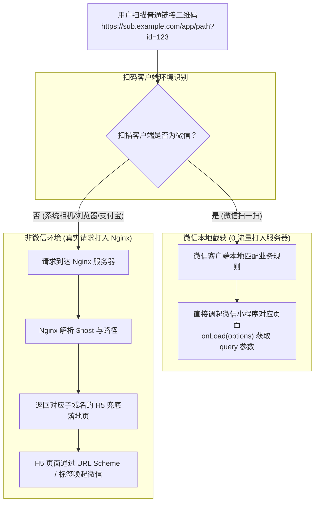

# Nginx 极简动态配置指南：一套规则承载 N 个微信小程序普通二维码与 H5 智能兜底

微信小程序的**「扫普通链接二维码打开小程序」**（即业务域名扫码直跳小程序）是线上线下引流、一码多端的核心功能。但在实际业务扩展中，很多运维与前端开发者常常陷入两难困境：
- 随着接入业务线变多，拥有成百上千个二级域名或独立小程序；
- 每次在微信公众平台配置规则时，都要手动上传微信校验文件（如 `NjK8s7Dl.txt`）并修改 Nginx 配置；
- 非微信环境（手机系统相机、Safari、Chrome、支付宝）扫码时，页面直接 404，导致潜在用户严重流失。

本文将深入剖析普通二维码跳转的底层机制，并提供一套基于 Nginx 正则与 `$host` 动态变量的高可用生产架构——**后续无论新增多少个小程序或子域名，均无需修改 Nginx 配置，无需重启服务即可全自动即时生效**。

---

## 🧭 一、底层扫码工作流与架构认知

在编写 Nginx 配置前，首先必须厘清一个核心认知：**当用户使用微信“扫一扫”扫描普通二维码时，请求压根不会打到你的 Nginx 服务器上！**



从架构流向可以看出，**Nginx 在整套体系中只承担两个核心职责**：
1. **响应微信开放平台审核**：在配置规则时，承载并精准返回微信域名所有权验证文件（`.txt`）；
2. **非微信环境智能兜底**：当用户使用系统相机、iOS Safari、Android 浏览器或第三方 App 扫码时，返回对应业务的 H5 引导页，并尝试通过 URL Scheme 唤醒微信。

---

## ⚙️ 二、生产级 Nginx 终极动态配置

无论是一级域名分路径匹配，还是 N 个泛子域名（`*.example.com`）对应 N 个小程序，下面的配置均可实现**一套配置全量通吃**：

```nginx
# HTTP 80 强制跳转 HTTPS
server {
    listen 80;
    server_name *.example.com example.com;
    return 301 https://$host$request_uri;
}

# HTTPS 443 核心服务块
server {
    listen 443 ssl http2;
    # 开启泛域名匹配，兼容所有主域与子域
    server_name *.example.com example.com;

    # SSL 证书配置（建议使用泛域名通配符证书 *.example.com）
    ssl_certificate     /etc/nginx/ssl/example.com.crt;
    ssl_certificate_key /etc/nginx/ssl/example.com.key;
    ssl_protocols       TLSv1.2 TLSv1.3;
    ssl_ciphers         HIGH:!aNULL:!MD5;

    # =======================================================
    # 任务 1：微信域名校验文件统一正则拦截（零运维核心）
    # =======================================================
    # 微信校验文件格式均为：/随机字符串.txt（如 /MP_verify_xxx.txt 或 /NjK8s7Dl.txt）
    # 无论访问哪个子域名或路径下的 .txt，一律重定向至统一物理存储目录读取
    location ~* ^/[A-Za-z0-9_-]+\.txt$ {
        root /data/wechat_verify/;
        # 禁用缓存，确保微信平台验证时实时穿透读取
        add_header Cache-Control "no-cache, no-store, must-revalidate";
        access_log off;
    }

    # =======================================================
    # 任务 2：非微信扫码 H5 动态智能兜底
    # =======================================================

    # 场景 A：带子路径的扫码业务（如 https://a.example.com/app/）
    # 使用 alias 抹除 URL 中的 /app/ 前缀，动态映射到对应域名的 app_page 目录
    location /app/ {
        alias /data/h5_fallback/$host/app_page/;
        index index.html;
        try_files $uri $uri/ /app/index.html;
    }

    # 场景 B：根目录扫码业务（如 https://b.example.com/）
    # 使用 root 拼接路径，动态根据 $host 映射到对应子域名文件夹
    location / {
        root /data/h5_fallback/$host/;
        index index.html;
        try_files $uri $uri/ /index.html;
    }

    # 静态资源通用缓存优化
    location ~* \.(js|css|png|jpg|jpeg|gif|ico|svg|woff2)$ {
        root /data/h5_fallback/$host/;
        expires 7d;
        add_header Cache-Control "public, no-transform";
    }
}
```

---

## 📁 三、服务器物理目录规范与“零重启”工作流

配合上述 Nginx 配置，在服务器上建立规范化的目录结构。**后续新增任意小程序，只需往对应文件夹丢文件即可秒级生效，无需执行 `nginx -s reload`**：

```text
/data/
├── wechat_verify/               👈 所有的微信校验 .txt 文件统一扔在这里
│   ├── MP_verify_d6kGzX9a.txt   # 小程序 A 的校验文件
│   └── NjK8s7Dl.txt             # 小程序 B 的校验文件
│
└── h5_fallback/                 👈 兜底 H5 落地页的动态大本营
    ├── a.example.com/           # 自动匹配子域名 a.example.com
    │   ├── index.html           # 根目录扫码兜底页
    │   └── app_page/
    │       └── index.html       # /app/ 子路径扫码兜底页
    │
    └── b.example.com/           # 自动匹配子域名 b.example.com
        ├── index.html           # 根目录扫码兜底页
        └── app_page/
            └── index.html       # /app/ 子路径扫码兜底页
```

### 💡 零重启新增小程序操作流程：
1. **微信后台下载验证文件**：在小程序后台配置二维码规则，下载微信提供的 `xxx.txt` 文件；
2. **丢入校验目录**：`scp xxx.txt user@server:/data/wechat_verify/`；
3. **丢入 H5 兜底页面**：在 `/data/h5_fallback/` 创建对应的 `新域名/` 文件夹并放入 `index.html`；
4. **微信后台点击保存**：微信服务器 GET 请求检测 `https://新域名/xxx.txt` 瞬间通过验证！

---

## 🛠️ 四、高频踩坑点与原理解析

### 1. `root` 与 `alias` 的核心区别与末尾斜杠陷阱
很多开发者在写 `/app/` 这类带路径的路由时常遇到 404 错误。必须牢记其替换与拼接逻辑：
- **`root`（追加拼接）**：`root /data/dir;` 会将匹配到的 URI 完整追加在物理路径后。
  > 访问 `http://a.com/app/index.html` ➔ 实际寻找 `/data/dir/app/index.html`。
- **`alias`（直接替换）**：`alias /data/dir/;` 会把 `location` 中匹配的部分完全替换掉。
  > 访问 `http://a.com/app/index.html` ➔ 实际寻找 `/data/dir/index.html`。
- **避坑准则**：`location` 使用了斜杠结尾（如 `/app/`），`alias` 后面的路径**必须也以斜杠 `/` 结尾**，否则 Nginx 会拼接出错误的物理路径。

---

### 2. 微信校验文件命中 CDN / Nginx 缓存导致保存失败
在微信公众平台点击“保存并校验”时，经常报错“校验文件内容不匹配”或“404”，原因通常是：
- 前序校验失败的 404 响应被中间代理层或 Nginx 强行缓存；
- **解决方案**：在 `.txt` 的 location 块中显式追加 `add_header Cache-Control "no-cache, no-store, must-revalidate";`，确保每次请求均穿透读取磁盘。

---

### 3. 扫码 URL 携带业务参数时的传递机制
如果二维码链接带了复杂参数，如 `https://a.example.com/app/?shop_id=9527&table=8`：
- **微信内扫码**：微信客户端会自动截获并完整解析参数，在小程序的 `onLoad(options)` 中通过 `options.q`（URL 编码字符串）直接读取；
- **外部浏览器扫码**：Nginx 的 `try_files` 与静态代理会自动完整保留 Query String，H5 页面直接使用原生前端 API 读取即可：
  ```javascript
  // H5 兜底页面提取参数
  const urlParams = new URLSearchParams(window.location.search);
  const shopId = urlParams.get('shop_id');
  const table = urlParams.get('table');
  ```

---

### 4. H5 兜底页无缝唤醒微信小程序
当外部浏览器打开 H5 兜底页时，可通过两种方式唤起目标小程序：
1. **微信 URL Scheme（全端浏览器兼容）**：
   ```javascript
   // 后端调用微信服务端接口生成短链 scheme
   window.location.href = 'weixin://dl/business/?t=T8xY7zA1b2c';
   ```
2. **微信开放标签 `<wx-open-launch-weapp>`（微信内 H5 专用）**：在微信内置浏览器打开 H5 时，可直接使用微信开放标签渲染一键跳转按钮。

---

## 📋 五、生产上线自检清单 (Checklist)

- [ ] **域名解析与证书**：
  - [ ] 是否配置了解析至服务器的泛域名 `*.example.com` DNS 记录？
  - [ ] SSL 证书是否为支持所有子域的泛通配符证书？
- [ ] **Nginx 校验规则**：
  - [ ] `location ~* ^/[A-Za-z0-9_-]+\.txt$` 正则是否放开并在统一目录建立 `/data/wechat_verify/`？
  - [ ] 是否禁用了 `.txt` 文件的 HTTP 缓存？
- [ ] **物理目录与兜底**：
  - [ ] 是否在 `/data/h5_fallback/` 下按子域名正确建立了文件夹树？
  - [ ] H5 落地页是否具备向微信 URL Scheme 唤醒跳转的逻辑？
- [ ] **真机验证**：
  - [ ] 微信“扫一扫”测试能否精准命中并打开指定小程序；
  - [ ] 手机自带相机扫描测试能否正常加载对应的 H5 引导页。

---

## 🎯 六、总结

通过巧妙利用 **Nginx 正则表达式匹配校验文件** 与 **`$host` 动态变量映射物理目录**，我们将复杂繁琐的 N 个小程序扫码配置彻底降维为纯静态的“丢文件”运维操作：
1. **校验文件**：统一扔进 `/data/wechat_verify/`，秒级通过微信审核；
2. **H5 兜底页**：按域名扔进 `/data/h5_fallback/$host/`，全自动动态路由；
3. **极致解耦**：从此告别繁琐的 Nginx 配置修改与服务重载！
