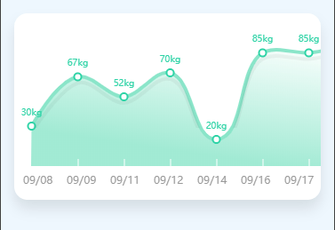

# 微信小程序原生 Canvas 绘制平滑贝塞尔曲线图组件

## 一、效果预览

利用原生 Canvas 的 `bezierCurveTo` 贝塞尔曲线算法，绘制出柔和渐变填充的高性能趋势曲线图：



---

## 二、WXML 布局代码

```html
<view class="chart-container">
  <canvas type="2d" id="curveCanvas" class="curve-canvas"></canvas>
</view>
```

---

## 三、JS 核心平滑曲线绘制算法

```javascript
Page({
  onReady() {
    const query = wx.createSelectorQuery();
    query.select('#curveCanvas')
      .fields({ node: true, size: true })
      .exec((res) => {
        if (!res[0]) return;
        const canvas = res[0].node;
        const ctx = canvas.getContext('2d');
        const dpr = wx.getSystemInfoSync().pixelRatio;

        canvas.width = res[0].width * dpr;
        canvas.height = res[0].height * dpr;
        ctx.scale(dpr, dpr);

        this.drawCurve(ctx, res[0].width, res[0].height);
      });
  },

  drawCurve(ctx, width, height) {
    const points = [
      { x: 30, y: 120 },
      { x: 90, y: 50 },
      { x: 150, y: 80 },
      { x: 210, y: 30 },
      { x: 270, y: 90 }
    ];

    ctx.clearRect(0, 0, width, height);
    ctx.beginPath();
    ctx.moveTo(points[0].x, points[0].y);

    // 计算三阶贝塞尔曲线控制点
    for (let i = 0; i < points.length - 1; i++) {
      const xc = (points[i].x + points[i + 1].x) / 2;
      const yc = (points[i].y + points[i + 1].y) / 2;
      ctx.quadraticCurveTo(points[i].x, points[i].y, xc, yc);
    }

    ctx.strokeStyle = '#0284c7';
    ctx.lineWidth = 3;
    ctx.stroke();
  }
});
```
