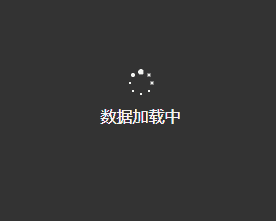

# 微信小程序自定义高颜值 Loading 加载动画组件

## 一、效果预览



---

## 二、WXML 骨架

```html
<view class="loading-mask" wx:if="{{loading}}">
  <view class="loading-spinner">
    <view class="dot" wx:for="{{8}}" wx:key="index" style="--i: {{index}}"></view>
  </view>
  <view class="loading-text">{{loadingText || '数据加载中...'}}</view>
</view>
```

---

## 三、WXSS 纯 CSS3 旋转动画

```css
.loading-mask {
  position: fixed;
  inset: 0;
  background: rgba(0, 0, 0, 0.75);
  display: flex;
  flex-direction: column;
  align-items: center;
  justify-content: center;
  z-index: 99999;
}

.loading-spinner {
  position: relative;
  width: 60rpx;
  height: 60rpx;
  margin-bottom: 20rpx;
}

.loading-spinner .dot {
  position: absolute;
  width: 6rpx;
  height: 6rpx;
  border-radius: 50%;
  background: #ffffff;
  animation: pulse 0.8s linear infinite;
}

@keyframes pulse {
  0%, 100% { transform: scale(1); opacity: 0.3; }
  50% { transform: scale(2.5); opacity: 1; }
}

.loading-text {
  color: #ffffff;
  font-size: 26rpx;
}
```
